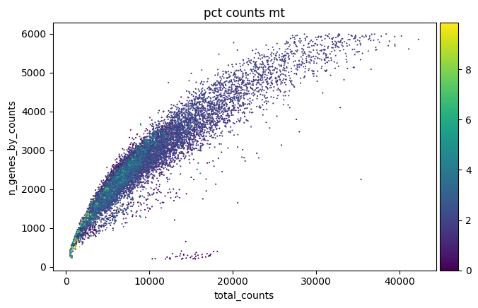

# Mouse gut and spine single cell transcriptomics

## Report #2

### Background

NOTE: In a previous iteration, data was analyzed in R, using the Seurat pipeline. Here, because some models for cell classification in the mouse gut (for cecum cells classification) and some mouse brain that could serve at least as guides to classify spinal cord cells.

Mice were fed with control diet or supplemented with B-fructan. Spinal cord and cecum tissues were dissected, enzymatically digested, FACS-sorted and finally subjected to 10X single-cell library construction.

Libraries were sequenced on a NovaSeq Illumina instrument at an average depth of 500,000,000 150-cycles paired-end reads per library. 

Metadata of libraries is included here:


| scseq ID | Disease | Diet      | Tissues |	Mouse ID       |
|----------|---------|-----------|---------|-----------------|
| C1	     | MS	     | B-fructan | Gut	   | 7_BF-21-Cecum   |
| C2	     | MS	     | B-fructan | Gut	   | 8_BF-26-Cecum   |
| C3	     | MS	     | B-fructan | Gut	   | 9_BF-27-Cecum   |
| C4	     | MS	     | Control	 | Gut	   | 10_CON-23-Cecum |
| C5	     | MS	     | Control	 | Gut	   | 11_CON-25-Cecum |
| C6	     | MS	     | Control	 | Gut	   | 12_CON-29-Cecum |
| B7	     | MS	     | B-fructan | Spine	 | 1_CON-23-Spine  |
| B8	     | MS	     | B-fructan | Spine	 | 2_CON-25-Spine  |
| B9	     | MS	     | B-fructan | Spine	 | 3_CON-29-Spine  |
| B10	     | MS	     | Control	 | Spine	 | 4_BF-21-Spine   |
| B11	  	 | MS      | Control	 | Spine	 | 5_BF-26-Spine   |
| B12		   | MS      | Control	 | Spine	 | 6_BF-27-Spine   |


### Quantification

Libraries were quantified using the proprietary pipeline from 10X genomics cellranger. We decided to use this pipeline because it relies on genome and GTF files, which allows to use all annotated elements on the genome, including pseudo-genes and non-conding RNAs. Methods like kallisto bus or salmon alevin are based on only the annotated transcriptome and therefore only include protein-expressing genes.

The mouse genome was formatted for cellranger using script mkref_GRCm38.sh. Quantification of libraries was conducted with the following code:

```bash
# Path to the reference genome
REF_PATH="/home/dayhoff/sdd/juan/projects/heatherArmstrong/SC_study/mm10"

# Path to your FASTQ files
FASTQ_PATH="/home/dayhoff/sdd/juan/projects/heatherArmstrong/SC_study"

# Array of sample names
SAMPLES=("B10" "B11" "B12" "B7" "B8" "B9" "C1" "C2" "C3" "C4" "C5" "C6")

# Run cellranger count for each sample
for SAMPLE in "${SAMPLES[@]}"; do
	echo "Processing sample: ${SAMPLE}"
		        
	cellranger count \
	--id="${SAMPLE}_count" \
	--transcriptome="${REF_PATH}" \
	--fastqs="${FASTQ_PATH}" \
	--sample="${SAMPLE}" \
	--localcores=8 \
	--localmem=64 \
	> "${SAMPLE}_count.log" 2>&1
	echo "Finished processing sample: ${SAMPLE}"
done
```

### Quality control

Quantification matrices were then postprocessed using a (postProcessing_mouseSC.ipynb) iPython workbook and the pipeline Scanpy.

In an ideal library, the number of mitochondrial reads should be low, lower than 5% and the correlation between mitochondrial RNA and total RNA (nCount_RNA) should be low, while the correlation between total RNA (nCount_RNA) and number of genes (n_Feature_RNA) should be high, ideally higher than 90%.

Thus, when filtering data, parameters should be chosen to adjust those correlation coefficients conveniently.

### Inspection of metrics: percentage of mt RNA, number of genes and total RNA

Based on initial inspection of metrics, it was decided to filter data according to the following thresholds:

##### Gut

# Filter cells based on QC metrics
cecum_adata_combined = cecum_adata_combined[
    (cecum_adata_combined.obs["pct_counts_mt"] < 10) &
    (cecum_adata_combined.obs["n_genes_by_counts"] < 6000) &
    (cecum_adata_combined.obs["n_genes_by_counts"] > 200)
]

##### Spine

spine_adata_combined = spine_adata_combined[
    (spine_adata_combined.obs["pct_counts_mt"] < 10) &
    (spine_adata_combined.obs["n_genes_by_counts"] < 6000) &
    (spine_adata_combined.obs["n_genes_by_counts"] > 200)
]
Based on the plots after filtering, those thresholds seemed to be a good compromise.

All cecum and spines were merged and labeled according to the metadata table shown above.

##### Tissue: Cecum
##### Before filtering
Metrics
<table>
  <tr>
    <td></td>
  </tr>
</table>

Correlation
<table>
  <tr>
    <td></td>
  </tr>
</table>

##### Tissue: Spine
##### Before filtering
Metrics
<table>
  <tr>
    <td></td>
  </tr>
</table>

Correlation
<table>
  <tr>
    <td></td>
  </tr>
</table>

##### Tissue: Cecum
##### After filtering

Metrics
table>
  <tr>
    <td></td>
  </tr>
</table>

Correlations
<table>
  <tr>
    <td></td>
  </tr>
</table>

##### Tissue: Spine
##### After filtering

Metrics
table>
  <tr>
    <td></td>
  </tr>
</table>

Correlations
<table>
  <tr>
    <td></td>
  </tr>
</table>


### Inspection and characterization of individual samples in merged objects

Merged datasets were subjected to preprocessing and UMAP plotting, colouring the plots by sample:

##### Tissue: Cecum

<table>
  <tr>
    <td></td>
  </tr>
</table>

As can be seen in the plots above, cecum samples overlap pretty good. Except an orange cluster on the left (sample C2).
  
##### Tissue: Spine

<table>
  <tr>
    <td></td>
  </tr>
</table>

As can be seen in the plots above, spine samples overlap pretty good. However, a cluster, enclosed in a square looks interesting and deserves atention as it could be a fructan-induced subpopulation of cells.


### Inspection and characterization of groups in merged objects

Merged datasets were subjected to preprocessing and UMAP plotting, colouring the plots by group:

##### Tissue: Cecum

<table>
  <tr>
    <td></td>
  </tr>
</table>

As can be seen in the plots above, cecum groups overlap pretty good. Except a blue cluster on the left (which corresponds to sample C2 and it is likely not group-specific, but sample specific).
  
##### Tissue: Spine

<table>
  <tr>
    <td></td>
  </tr>
</table>

As can be seen in the plots above, spine samples overlap pretty good. However, a cluster in blue, corresponding to the fructan group, is interesting and deserves atention as it could be a fructan-induced subpopulation of cells.


### Inspection of quality metrics by Leiden clusters

#### Diagnostic and removal of doublets

Doublets correspond to droplets with more than a single cell. Scanpy offers the Scrublet method to identify and subsequently remove doublets. It was applied, and this is how the data looks after doublets removal.

#### Tissue: Cecum

<table>
  <tr>
    <td></td>
  </tr>
</table>


#### Tissue: Spine

<table>
  <tr>
    <td></td>
  </tr>
</table>


#### Canonical QC metrics per Leiden cluster

As mentioned above, number of genes, total RNA and percentage of mitochondrial RNA are typical QC metrics to inspect. Here they are presented on a UMAP projection.


#### Tissue: Cecum

<table>
  <tr>
    <td></td>
  </tr>
</table>

#### Tissue: Spine

<table>
  <tr>
    <td></td>
  </tr>
</table>


#### Spine datasets

All spine and all spine samples were merged into a single dataset, but keeping the original annotations. UMAP plots were generated and were coloured by:

##### 1. Original identity

Unlike gut samples, all samples from spinal cord appear to behave as expected. So, no samples are suggested to be removed.

<table>
  <tr>
    <td></td>
  </tr>
</table>

##### 2. By diet

Again, everything looks good.

<table>
  <tr>
    <td></td>
  </tr>
</table>

##### 3. Seurat clusters

Each cluster here likely represent a different type of cell, there are two ways to label them, either by identifying a profile of the same tissue in mouse in the published literature, or investigating, also in the literature, which markers are available for the types of cells expeted in the spine.

<table>
  <tr>
    <td></td>
  </tr>
</table>

Some expected types of cells in spinal cord are: 

##### Neuronal cells
Motor neurons
Interneurons
Sensory neuron projections

##### Glial cells:
Astrocytes
Oligodendrocytes
Microglia
NG2 cells/Oligodendrocyte precursor cells

##### Progenitor/Stem cells
Neural progenitor cells

##### Endothelial and Perivascular Cells
##### Ependymal cells
##### Pericytes
##### Meningeal cells

Cell type classification still needs to be done.

### Identification of markers per cluster

Preliminary automated marker exploration produced some relatively clear markers for spine clusters, but way less informative for cecum cells.

#### Putative markers for gut (cecum) cells

##### Heatmap

<table>
  <tr>
    <td></td>
  </tr>
</table>

##### Dotplot

<table>
  <tr>
    <td></td>
  </tr>
</table>


#### Putative markers for spinal cord cells

##### Heatmap

<table>
  <tr>
    <td></td>
  </tr>
</table>

##### Dotplot

<table>
  <tr>
    <td></td>
  </tr>
</table>


### Differential expression analysis

For each tissue, differential expression analysis, between control and B-fructan groups was conducted using the Wilcoxon test. 

#### Differentially expressed genes for gut (cecum) cells

<table>
  <tr>
    <td></td>
  </tr>
</table>

Please see file gut_DE_results_Wilcoxon_Control_vs_B-fructan.xlsx

#### Differentially expressed genes for spinal cord cells

<table>
  <tr>
    <td></td>
  </tr>
</table>

Please see file spine_DE_results_Wilcoxon_Control_vs_B-fructan.xlsx
